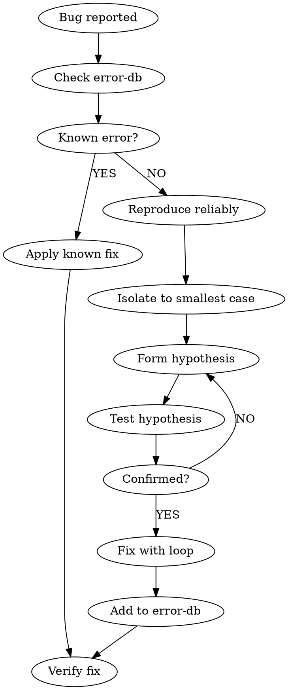

# Daedalos Debug - Systematic Bug Investigation

## Overview

Don't guess. Diagnose systematically: reproduce, isolate, understand, then fix.

## MANDATORY WORKFLOW



## Step-by-Step

### 1. Check Error Database First

```bash
error-db search "ModuleNotFoundError"
error-db search "Cannot read property"
error-db search "<paste error message>"
```

If found, apply the known solution. If not, continue.

### 2. Create Checkpoint

Before ANY debugging:

```bash
undo checkpoint "before-debug"
```

### 3. Reproduce Reliably

Can you make it happen consistently?

```bash
# Run the failing command
pytest tests/test_auth.py::test_login -v

# Note EXACT steps to reproduce
# Note EXACT error message
```

### 4. Isolate the Problem

Narrow down to the smallest failing case:

```bash
# Search for relevant code
codex search "the function that's failing"

# Check recent changes
git diff HEAD~5

# Find related files
project deps src/auth.py
```

### 5. Form and Test Hypotheses

Don't guess randomly. Form specific hypotheses:

| Hypothesis | Test |
|------------|------|
| "Variable is None" | Add `print(variable)` or `assert variable is not None` |
| "Function not called" | Add logging at function entry |
| "Wrong argument order" | Print arguments at call site |
| "Race condition" | Add sleep/synchronization |

### 6. Fix with Loop

Once you understand the bug:

```bash
loop start "fix: <specific bug description>" --promise "pytest tests/test_auth.py"
```

### 7. Add to Error Database

If this is a new error pattern:

```bash
error-db add "pattern" "solution" --category python
```

## Debugging Tools

```bash
# Search codebase semantically
codex search "authentication failure handling"

# Check project structure
project info

# Find what depends on buggy code
project dependents src/auth.py

# See file change history
undo timeline

# Roll back if needed
undo last
undo restore "before-debug"
```

## Red Flags - STOP These Patterns

| Thought | Reality |
|---------|---------|
| "I think I know what's wrong" | Reproduce first. Confirm the actual error. |
| "Let me try this quick fix" | Understand before fixing. Quick fixes often miss root cause. |
| "It works on my machine" | Isolate environment differences. Check dependencies. |
| "The error message is wrong" | Error messages are usually accurate. Read carefully. |
| "I'll just restart and see" | Restart might mask the issue. Understand first. |

## Common Debug Patterns

### Import/Module Errors

```bash
# Check Python path
python -c "import sys; print(sys.path)"

# Check if module exists
python -c "import module_name"

# Check installed packages
pip list | grep package_name
```

### Async/Timing Issues

```bash
# Add explicit waits to isolate
# Check for race conditions
# Look for missing await/async
```

### State Issues

```bash
# Print state at key points
# Check initialization order
# Look for mutations
```

## Example Debug Session

```bash
# 1. See the error
$ pytest tests/test_auth.py -v
FAILED - AttributeError: 'NoneType' object has no attribute 'email'

# 2. Check error database
$ error-db search "NoneType has no attribute"
Found: This usually means a variable is None when expected to have a value.
Solution: Check where the variable is assigned and why it might be None.

# 3. Create checkpoint
$ undo checkpoint "debug-none-error"

# 4. Find relevant code
$ codex search "user email attribute access"
src/auth.py:42 - user = get_user(user_id)
src/auth.py:43 - return user.email  # <-- Here!

# 5. Form hypothesis
# Hypothesis: get_user returns None for invalid user_id

# 6. Test hypothesis
$ python -c "from src.auth import get_user; print(get_user(999))"
None

# 7. Confirmed! Fix with loop
$ loop start "handle None return from get_user" --promise "pytest tests/test_auth.py"

# 8. Add to error database
$ error-db add "get_user returns None" "Check user_id validity before accessing attributes" --category auth
```

## Philosophy

"Debugging is not guessing. It's systematic investigation."

Every bug has a cause. Your job is to find it through methodical elimination, not random changes. The loop is your friend - it lets you iterate on fixes with verification.
