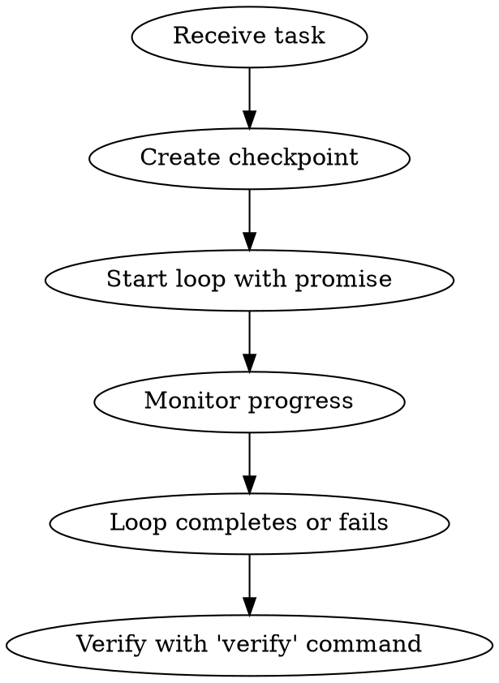

# Daedalos Loop - Iterate Until Done

## Overview

The loop is THE core primitive of Daedalos. Instead of trying to get things right in one pass, embrace iteration: try, verify, learn, repeat.

## When to Use

- Implementing features ("add user authentication")
- Fixing bugs ("fix the memory leak")
- Refactoring ("extract repository pattern")
- Any task with a clear verification command

## MANDATORY WORKFLOW



## Step-by-Step

### 1. Create Safety Checkpoint

Before ANY significant work:

```bash
undo checkpoint "before-feature-x"
```

This lets you roll back if things go wrong.

### 2. Start the Loop

```bash
# Basic loop - iterate until tests pass
loop start "implement user login" --promise "pytest"

# With max iterations (safety limit)
loop start "fix auth bug" --promise "npm test" --max 20

# Using a template
loop start --template tdd "add password reset"
```

### 3. Monitor Progress

```bash
loop status              # Quick status
loop watch               # Live dashboard (TUI)
loop history <id>        # See iteration history
```

### 4. Control the Loop

```bash
loop pause <id>          # Pause if needed
loop resume <id>         # Continue
loop inject <id> "focus on the edge case"  # Add context mid-loop
loop cancel <id>         # Stop gracefully
```

### 5. After Loop Completes

Always run full verification:

```bash
verify                   # Full pipeline: lint, types, build, test
```

## Loop Templates

Use templates for common patterns:

| Template | Use Case | Phases |
|----------|----------|--------|
| `tdd` | Test-driven development | Write test → Implement → Refactor |
| `bugfix` | Bug fixing | Reproduce → Fix → Verify no regression |
| `refactor` | Safe refactoring | Baseline tests → Refactor → Verify |
| `feature` | Full feature | Implement → Test → Document |

```bash
loop start --template tdd "add email validation"
```

## Promise Commands

The promise is how the loop knows when to stop:

```bash
# Exit code 0 = success
--promise "pytest"                    # Python tests
--promise "npm test"                  # Node tests
--promise "cargo test"                # Rust tests
--promise "verify --quick"            # Daedalos quick check
--promise "verify"                    # Full verification

# String match
--promise "All tests passed"          # Match in output

# Regex
--promise-pattern "0 failures"        # Regex match
```

## Red Flags - STOP These Patterns

| Thought | Reality |
|---------|---------|
| "I'll just fix this manually" | Use the loop. It tracks iterations and can rollback. |
| "One more try without the loop" | The loop IS how intelligent work gets done. |
| "Tests are passing, I'm done" | Run `verify` to check lint, types, AND tests. |
| "I don't need a checkpoint" | Always checkpoint before significant changes. |

## Integration with Other Tools

```bash
# Checkpoint before loop
undo checkpoint "pre-refactor" && loop start "refactor auth" --promise "verify"

# Search for relevant code first
codex search "authentication" | head -20

# Check project structure
project info
```

## Example Session

```bash
# 1. Understand the codebase
project info
codex search "user authentication"

# 2. Create safety net
undo checkpoint "before-auth-feature"

# 3. Start iterating
loop start "implement JWT authentication" --promise "verify" --max 30

# 4. Monitor (in another terminal)
loop watch

# 5. After completion, double-check
verify
git diff
```

## Philosophy

"Single-pass inference is a myth. The best code comes from iteration."

The loop embraces reality:
1. Try something (probably wrong)
2. See what breaks (feedback)
3. Learn from the failure (context accumulates)
4. Try again with new knowledge

Don't aim for perfect on the first try. Let the loop refine the work.
