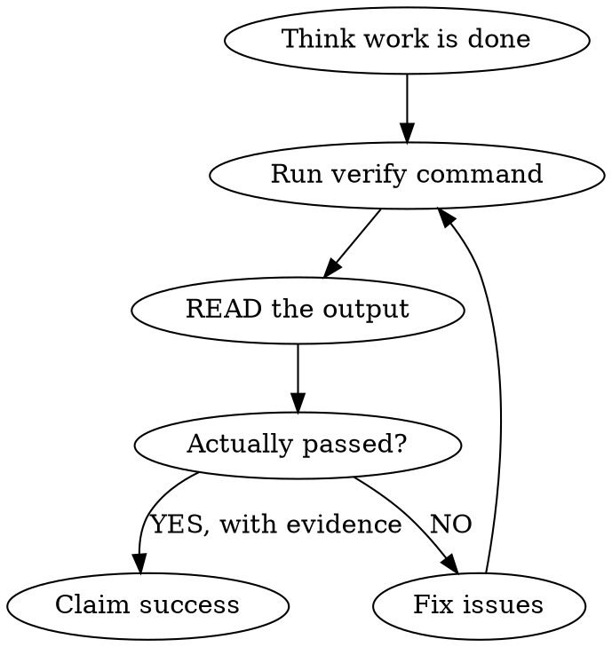

# Daedalos Verify - Evidence Before Assertions

## Overview

Never claim success without evidence. Run verification, read the output, confirm it passed.

## MANDATORY WORKFLOW



## The Rule

**Before saying ANY of these:**
- "Done!"
- "Fixed!"
- "Tests pass!"
- "All good!"
- "Ready for review!"

**You MUST:**
1. Run `verify`
2. READ the output
3. Confirm it shows success
4. Include evidence in your response

## Verification Commands

```bash
# Full verification (lint + types + build + test)
verify

# Quick check (lint + types only)
verify --quick

# Only staged files
verify --staged

# Auto-fix what can be fixed
verify --fix
```

## What Verify Checks

| Check | What It Does |
|-------|--------------|
| Lint | Code style, anti-patterns |
| Types | Type errors, missing types |
| Build | Compilation, bundling |
| Test | Unit tests, integration tests |

Auto-detects project type:
- Python: ruff → mypy → pytest
- TypeScript: eslint → tsc → build → test
- Rust: clippy → check → build → test
- Go: vet → build → test
- Swift: swiftlint → build → test

## Red Flags - STOP These Patterns

| Thought | Reality |
|---------|---------|
| "It should work" | Run verify. "Should" isn't evidence. |
| "I just ran it a minute ago" | Run it again. Things change. |
| "Only changed one line" | One line can break everything. Verify. |
| "Tests were passing before" | Verify NOW, before claiming success. |
| "I'll verify after I tell the user" | Verify FIRST. Evidence before assertions. |

## Correct Response Pattern

**WRONG:**
```
Done! The feature is implemented and tests pass.
```

**RIGHT:**
```
Running verification...

$ verify
✓ Lint passed
✓ Types passed
✓ Build passed
✓ Tests passed (42 tests, 0 failures)

All checks pass. The feature is ready.
```

## Integration with Loops

Loops should use verify as the promise:

```bash
# Use verify as your loop promise
loop start "fix auth bug" --promise "verify"

# Or quick verify for faster iteration
loop start "fix lint errors" --promise "verify --quick"
```

## Pre-Commit Verification

Before committing:

```bash
# Verify staged changes
verify --staged

# If issues, fix them
verify --fix

# Then commit
git add -A && git commit -m "feat: add feature"
```

## Full Workflow Example

```bash
# 1. Make changes
# ... edit code ...

# 2. Verify locally
verify

# 3. If issues, fix them
verify --fix  # Auto-fix what can be fixed

# 4. Verify again
verify

# 5. Only then claim success
# "Verification passed: lint ✓, types ✓, build ✓, tests ✓"
```

## Philosophy

"Evidence before assertions. Always."

This isn't about distrust - it's about accuracy. Verification is fast. Wrong claims waste time. Run the check, read the output, report with confidence.
